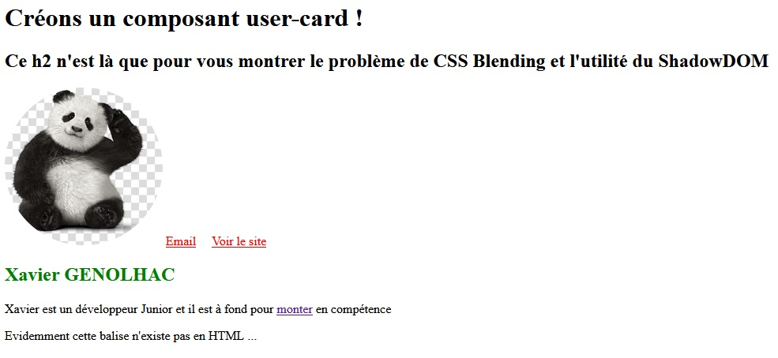

  

# Ma première API
Un petit exemple fait en suivant le [tuto de Lior CHAMLA](https://www.youtube.com/watch?v=zrigq4HIecM&list=PLpUhHhXoxrjf-CGm82kXtbrAtoMsO5xsL) pour comprendre et utiliser une API
